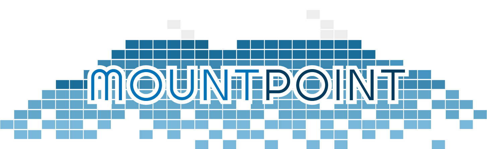

<link rel="stylesheet" href="style.css">

# mountpoint 
## August 27, 2018 

| Time  	| Session  	| Session  	|
|---	|---	|---	|
|  Opening: 9am - 9:15am 	|   	|   	|
| 9:15am - 9:55am  	|  Approaches for duplicating Kubernetes storage with Gluster 	|  Bringing smart device failure prediction to Ceph 	|
|  10:00am - 10:45am 	|  Next-level storage automation with Operators 	| Pains & Pleasures Testing the Ceph Distributed Storage Stack  	|
|   11:00am - 11:45am	|  A Cockpit view of gluster 	|   Ceph cloud object storage: the right way	|
| Lunch  	|   	|   	|
|  1:00pm - 1:45pm 	|  Where is my file anyway: A tour of on-disk Gluster data 	|   Lessons Learned Scaling Ceph for Public Clouds	|
|  2:00pm - 2:45pm	|  Container sharding: A deep dive into the biggest feature in the history of Swift 	|  Rook: Storage Orchestration for a Cloud-Native World 	|
|  3:00pm - 3:45pm		|  Modernizing storage system patterns using container technologies 	|   What's new in Ceph	|
|  Roundtable 4:00pm - 4:45pm|   	|   	|
|  Closing - 4:45pm to 5:00pm 	|   	|   	|

### Approaches for duplicating Kubernetes storage with Gluster
Many container workloads that are designed for scaling up have a need to consume an initial dataset. There are different ways to populate the PersistentVolume before the app may start. In this talk, Niels explains the options to snapshot and clone PVs through a standard Kubernetes interface.

Speaker: Niels de Vos

Niels is a core-developer and maintainer for Gluster. He is employed by Red Hat and works together with other teams who provide professional support for Red Hat Gluster Storage. The main areas where Niels is active include network protocols, low-level/Operating Systems improvements and integration with other Open Source projects like QEMU, NFS-Ganesha and more recently Kubernetes.
When Niels is not hacking on Open Source software, you are most likely to find him on a squash court or cycling around in the area near Amsterdam where he lives.

### Bringing smart device failure prediction to Ceph
This talk will describe our journey adding device health metric collection, prediction, and automated mitigation to Ceph, including several false starts and half-baked adventures with SaaS-based prediction.  We'll also discuss the opportunity to build a public data set of device failure data to build a high quality, free and open source model for use in any storage system.

Speaker: Sage Weil

Sage originally designed Ceph as part of his PhD research at the University of California, Santa Cruz. Since then he has worked to build an open source community around the project to provide a robust and stable object, block, and file storage solution that is free as in speech and beer.  Sage co-founded Inktank in 2012, serving as CTO, and now works for Red Hat where he continues to lead the Ceph development community.

### Next-level storage automation with Operators
The dream: Storage that responds to all your needs. While we are not quite there yet, Gluster has come a long way towards that since first introducing software-defined storage into Kubernetes. Following the Operator design pattern, we have taken the business logic of tasks that used to require external tooling and human intervention and automated them around Kubernetes controllers to bring a more dynamic and responsive storage experience.

This talk will focus on the implementation of the Gluster Operator, how we changed the deployment of Gluster along the way, and what lies ahead for the Operator's development. There will also be a demo showcasing the deployment of a Gluster cluster and using it for dynamic provisioning.

Speakers: Humble Chirammal, Joe Julian, and Jose Rivera 

Joe Julian has been in the industry for over 30 years, has been using Gluster for over 10 years, and Kubernetes for a much shorter 2 years - developing a reference implementation and best practice documents for Samsung SDS and helping them implement their new container-native strategy that will be used for all Samsung companies.
Jose Rivera is a Senior Software Engineer at Red Hat, part of the Container-Native Storage team within Red Hat Storage. He is project lead of the gluster-kubernetes project on GitHub. Currently he is helping develop the Gluster Operator and improving the user experience on both Kubernetes and OpenShift through automation and documentation.

### Pains & Pleasures Testing the Ceph Distributed Storage stack
Testing a distributed storage system requires its own distributed system! The Ceph project built “teuthology" to fill this role, and has continued to refine it over the last 7 years. Learn about our successes and failures from both technical and community perspectives.

Speaker: Greg Farnum 

Greg Farnum has been in the core Ceph development group since 2009. Now a Red Hat employee, Greg has done major work on all components of the Ceph ecosystem and currently focuses on the core RADOS system.

### A Cockpit view of gluster
Cockpit is a server manager that makes it easy to administer your GNU/Linux servers via a web browser. In this talk, learn how Cockpit can be also be used to deploy and manage your Gluster deployments.

Speakers: Sahina Bose and Gobinda Das

Sahina Bose is an Engineering Manager at Red Hat. She is an active contributor and maintainer for the Gluster integration in oVirt, the open source virtualization management platform. 
Gobinda Das is a Senior Software Engineer at Red Hat. He is interested in all things to do with making Gluster easier to manage, and is an active contributor to oVirt and Cockpit.

### Ceph cloud object storage: the right way
Object storage design, valuable features and practical advice: from security, through multipart upload and versioning, performance improvements and disaster recovery.

Speaker: Orit Wasserman

Orit is an experienced software engineer who is passionate about open source and infrastructure with extensive experience with distributed systems and storage. Currently she is working on Ceph object storage (Ceph Rados Gateway), a highly available distributed software defined storage designed to scale and handle PetaBytes scale. Previously she worked on live migration for KVM/QEMU and developed nested virtualization for KVM at IBM Research Labs.

### Where is my file anyway: A tour of on-disk Gluster data
Gluster is a distributed file system, which sits on top of existing file system. Depending on which feature of Gluster you are using, the layout the actual data can be different. Distributed layout logic in Gluster can get confusing for many users. Now bring the whole logic of replication or disperse (EC) based volumes, it will add more complexity. Now, for some users we have 'shard' feature, where the layout changes mores. It gets even more interesting when we add a feature called 'RIO'.

Speakers: Shyamsunder Ranganathan & Amar Tumballi 

Shyam is a member of the TLC (tech leadership council) in Gluster Upstream, and also manages the releases in Gluster. Involved in RIO work to help Gluster's scalability. 
Amar is one of the day-0 member of GlusterFS project, and also currently active in Gluster Upstream.

### Lessons Learned Scaling Ceph for Public Clouds
DigitalOcean operates fifteen+ Ceph clusters that provide block and object services to global customers.  Topics covered include our experience as our deployments and user base has grown:
SSD vs HDD:  use-case vs economics vs RAS (including replication vs EC)
Cluster sizing:  efficiency vs subtle costs (RAM, blast radius, RUs)
Snap delete flooding
All SSDs are not created equal: cliffing, aging, firmware
Vanity cluster names:  sigh
Value of centralized or automated ceph.conf management
Gather all the metrics you can even if you don't think you need them yet
Future:
Mimic challenges and opportunities
BlueStore repaving
Ceph-mgr rebalancer
All-NVMe clusters
Eliminate the private / replication network (heresy!)

Speaker: Anthony D'Atri

Anthony D'Atri's career in system administration has spanned laptops to vector supercomputers. He has brought his passion for fleet management and the underlying server components to bear on a holistic yet, detailed approach to deployment and operations. Experience with architecture, operation, and troubleshooting of NetApp, ZFS, SVM, and other storage systems dovetailed neatly into Ceph. Three years with Ceph as a petabyte-scale object and block backend to multiple OpenStack clouds at Cisco additionally built on Anthony's depth. Now helping deliver awesome storage to DigitalOcean's droplet customers, Anthony aims to help the growing community build success with Ceph.

### Container sharding: A deep dive into the biggest feature in the history of Swift 
Container sharding is the biggest single feature that’s been added to OpenStack Swift. It allows for billions of objects to be stored in a single container. This talk will go into detail about how the feature works.

Speaker: John Dickinson

John Dickinson is Director of Technology at SwiftStack and Project Technical Lead for OpenStack Swift. He began contributing to Swift in 2009, well before the project was open sourced in 2010 as one of the founding projects in OpenStack. John works with developers and deployers all around the world to ensure that Swift is the best object storage system available.

### Rook: Storage Orchestration for a Cloud-Native World
With the rise in popularity of cloud-native environments, the way that storage systems are run and managed has needed to adapt. In this talk, we will explore principles of orchestration for storage in cloud-native environments and walk through the architecture of the open-source Rook project.  We will also take a deep dive into Rook's orchestration of Ceph, a distributed storage system designed for performance, reliability and scalability.

Speakers: Travis Nielsen, Jared Watts

Jared Watts is a Founding Engineer at Upbound, where he is working on advancing cloud-native computing by "freeing the cloud" and is also a maintainer for the open source Rook project (https://rook.io/). Before Upbound, he worked on innovative storage projects at Quantum Corp. and helped found Rook. Prior to Quantum, Jared worked on P2P storage distributed across the public internet at Symform, a startup later acquired by Quantum. Before that, Jared began his career at Microsoft working on applications for Windows Server setup and management.
Travis Nielsen is a Senior Principal Software Engineer for Red Hat where he is a maintainer on Rook and advocate for Kubernetes Operators. Prior to Red Hat, Travis worked in storage at Quantum and Symform, a P2P storage startup, and was an engineering lead for the Windows Server group at Microsoft.

### Modernizing storage system patterns using container technologies
Users have embraced the simplicity of managing containers at scale. Containerized applications can now easily be packaged, deployed, and managed on a containerized orchestration (CO) system like Kubernetes. Like any operating system, Kubernetes provides a set of functional primitives, process and resource management, and the ability to be extended. Now, users are looking to manage their applications, networking, and storage using the same control plane, no longer needing specialized administrators. Storage developers innovating new features in their storage systems need to be aware of these requirements and how to integrate their storage systems with the COs. In this presentation we will satisfy some of these requirements using the following models: storage locality, container native interfaces, cloud technologies, and operators. We will also provide demonstrations of these concepts.

Speakers: Luis Pabón and Kyle Schochenmaier

Luis Pabón is the control plane architect at Portworx and also participates in the Kubernetes and CSI storage communities. Prior to joining Portworx in September of 2017, he worked at CoreOS, Red Hat Storage, NetApp Advanced Technology Group, and at EMC on various storage products. He also previously presented at Linux Vault in 2015-2017. Luis is a core contributor on many open source projects including Kubernetes-CSI, and was the creator of Heketi and Quartermaster. Kyle Schochenmaier is a MTS at Portworx focusing on the data plane and underlying storage infrastructure. Prior to joining Portworx he worked at Nexenta Systems, Intel, WindRiver and the DOE on scale out storage, SDS, filesystems for supercomputing, and embedded systems.

